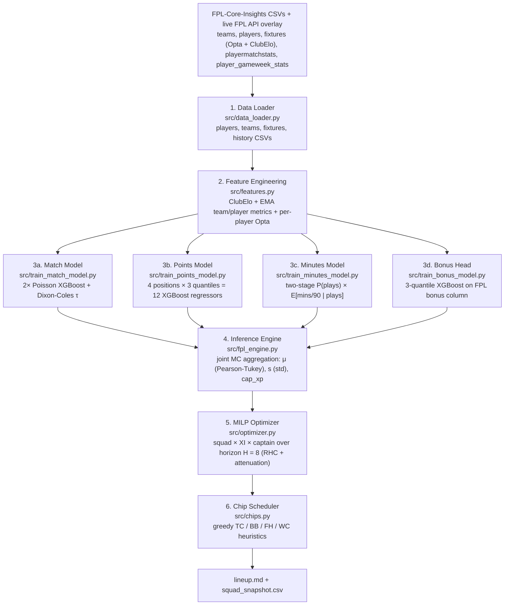

# Autonomous Fantasy Premier League ML Manager

[](https://www.python.org/)
[](https://xgboost.readthedocs.io/)
[](https://coin-or.github.io/pulp/)
[](../.github/workflows/weekly_update.yml)

Data-driven agent. Picks + manages 15-player Fantasy Premier League squad end-to-end. Weekly pipeline: learn per-position, per-player point distributions via quantile-regression gradient boosting; estimate match-level goal rates via Dixon–Coles-corrected Poisson; solve one joint MILP for squad + XI + captain over rolling horizon; schedule chips on top. Data: [olbauday/FPL-Core-Insights](https://github.com/olbauday/FPL-Core-Insights) CSVs (FPL API + Opta per-match stats + ClubElo, refreshed 2×/day) + thin live-FPL-API overlay for current-GW prices + injury status.

> **New to FPL?** Start with [FPL 101 primer](FPL_101.md). Math below assumes clean sheets, appearance points, bench-order auto-sub rule, transfer/chip system.

> **Scope:** Research project, personal use. Past model performance no guarantee future rank — league noisy, luck-driven by design.

---

## Table of Contents

1. [System Architecture](#1-system-architecture)
2. [Feature Engineering](#2-feature-engineering)
3. [Match Model](#3-match-model)
4. [Player Points Model](#4-player-points-model)
5. [Combinatorial Optimization](#5-combinatorial-optimization)
6. [Chip Scheduling](#6-chip-scheduling)
7. [Validation and Calibration](#7-validation-and-calibration)
8. [Repository Layout](#8-repository-layout)
9. [Installation and Usage](#9-installation-and-usage)
10. [Recently Shipped](#10-recently-shipped)
11. [Future Work](#11-future-work)
12. [References](#12-references)
13. [Data and Credit](#data-and-credit)
14. [License](#license)

---

## 1. System Architecture

End-to-end pipeline. FPL-Core-Insights CSVs + live-FPL-API price overlay → weekly markdown report: squad, XI, captain, transfers, hits, chip recs.



Model artifacts (Poisson + quantile boosters) + intermediate CSVs persist under `data/`. Subsequent runs retrain only on missing artifacts. GitHub Actions workflow [.github/workflows/weekly_update.yml](../.github/workflows/weekly_update.yml) re-runs pipeline every Wednesday 10:00 UTC.

---

## 2. Feature Engineering

Lives in [src/features.py](../src/features.py). Two feature families: team-level state for match model; player-level lags for points model. Both use strict GW-shift to prevent leakage.

### 2.1 Team Elo

Pre-match Elo per side precomputed on every fixture from FPL-Core-Insights (ClubElo, point-in-time per match — see [clubelo.com](https://clubelo.com)). Stamped on every fixture as `elo_h_pre` / `elo_a_pre`. Chronological replay below = fallback when dataset missing or null:

$$E_h = \frac{1}{1 + 10^{-(R_h + \text{HFA} - R_a)/400}}$$

$$
S_h = \begin{cases}
1   & \text{if } g_h > g_a \\
0.5 & \text{if } g_h = g_a \\
0   & \text{if } g_h < g_a
\end{cases}
$$

$$R_h' = R_h + K \cdot \text{MoV} \cdot (S_h - E_h), \qquad \text{MoV} = (\lvert g_h - g_a \rvert + 1)^{0.4}$$

MoV-multiplier idea from FiveThirtyEight sports-Elo — see [How We Calculate NBA Elo Ratings][ref-538]. Exponent $0.4$ differs from 538's NBA formula but same family; dampens blowouts, rewards decisive wins. Elo from chess → football match prediction well-studied — see [Using ELO ratings for match result prediction in association football][ref-hvattum] for bookmaker-odds validation. Hyperparameters below follow community sports-Elo conventions.

| Hyperparameter (fallback only) | Value |
|---|---|
| K-factor | 20 |
| Home-field advantage (HFA) | 60 Elo |
| Initial rating | 1500 |

### 2.2 Rolling team and player metrics

**Match** model: two stat families rolled forward at $w \in \{3, 5, 10\}$ for FPL-derived block, $w = 5$ for Opta block. Always **shift-1** — features for fixture at GW $t$ use only info available before GW $t$. Aggregator is an exponentially weighted moving average with **half-life** $w/2$, not an equal-weight rolling mean — recent GWs decay slowly, older GWs fade exponentially, no hard cutoff at $w$:

$$\overline{\text{xG}}_{T,t}^{(w)} = \frac{\sum_{k=1}^{t-1} \alpha_k \cdot \text{xG}_{T,k}}{\sum_{k=1}^{t-1} \alpha_k}, \qquad \alpha_k = (1/2)^{(t - 1 - k) / (w/2)}$$

| Source | Stats |
|---|---|
| Aggregated FPL `history` (per-team, per-GW sums) | xG, xGA, GF, GA |
| Opta team-level on `fixtures.csv` (one row per side per match) | true Opta xG (`oxg`), big chances (`obc`), total shots (`osh`), and each conceded counterpart |

**Points** model: per-player row uses lagged minutes $m_{i,t-1}, m_{i,t-2}, m_{i,t-3}$ + 5-/10-GW rolling per-player means of (xG, xA, xGI, BPS, ICT, saves, CBI, tackles, recoveries) + six per-player Opta stats from `playermatchstats.csv` (aggregated to per-(player, GW) sums first): Opta xG `oxg`, Opta xA `oxa`, chances created `occ`, touches in opp box `otob`, total shots `osh`, dribbles `odrib`. Fixture context from match-feature join: `is_home`, `opp_xg_5`, `opp_xga_5`, `opp_elo`, `own_elo`, `elo_gap`. Set-piece + pen-taker flags from FPL playerstats. Rolling `total_points` excluded on purpose — feedback loop: premium with one bad recent GW projects lower forever. Underlying xG/xA/ICT carry form signal without that pathology.

---

## 3. Match Model

Lives in [src/train_match_model.py](../src/train_match_model.py).

### 3.1 Poisson goal rates

Two independent XGBoost regressors with `count:poisson` objective model expected goals per side. Backbone: [XGBoost: A Scalable Tree Boosting System][ref-xgboost]:

$$\lambda_h = f_h(\mathbf{x}), \qquad \lambda_a = f_a(\mathbf{x})$$

where $\mathbf{x}$ = 31-dim match feature vector from §2. Bayesian hierarchical Poisson — see [Bayesian hierarchical model for the prediction of football results][ref-baio] — rejected: FPL API exposes single season, ~380 fixtures. Partial-pooling posteriors can't beat tree ensemble that captures non-linear interactions (press × block depth, Elo gap × home advantage, etc).

### 3.2 Dixon–Coles low-score correction

Independent Poisson marginals over-predict $(0,1)$ and $(1,0)$, under-predict $(0,0)$ and $(1,1)$ in football. [Modelling Association Football Scores and Inefficiencies in the Football Betting Market][ref-dc] fixes via multiplicative correction $\tau$ on joint PMF at four low-scoring corners:

$$P(X = x, Y = y) = \tau_{\lambda_h, \lambda_a}(x, y) \cdot \frac{\lambda_h^x e^{-\lambda_h}}{x!} \cdot \frac{\lambda_a^y e^{-\lambda_a}}{y!}$$

$$
\tau(x, y) = \begin{cases}
1 - \lambda_h \lambda_a \rho & \text{if } (x, y) = (0, 0) \\
1 + \lambda_h \rho           & \text{if } (x, y) = (0, 1) \\
1 + \lambda_a \rho           & \text{if } (x, y) = (1, 0) \\
1 - \rho                     & \text{if } (x, y) = (1, 1) \\
1                            & \text{otherwise}
\end{cases}
$$

Default $\rho = -0.10$ (negative, per original paper). Truncated joint PMF normalized to sum to 1 over $\{0, \dots, 8\}^2$.

ρ is tunable, but **only the joint score distribution is identifiable** — the τ correction redistributes mass between (0,0)↔(0,1) and (1,0)↔(1,1) and exactly conserves row and column marginals, so clean-sheet probabilities (column / row sums) are mathematically invariant to ρ. The earlier `cs_brier`-based grid was a no-op. [src/tune_dc_rho.py](../src/tune_dc_rho.py) now grid-searches $\rho \in \{-0.20, -0.15, -0.10, -0.05, 0\}$ (configurable) and ranks by mean negative log-likelihood of the **actual scoreline** under the DC-corrected joint PMF. Output → `data/processed/backtest/dc_rho_grid.csv`.

### 3.3 Clean-sheet probabilities (analytic)

Clean sheets computed directly from Dixon–Coles joint matrix $M$, not Monte Carlo:

$$P(\text{home CS}) = \sum_{x=0}^{8} M_{x, 0}, \qquad P(\text{away CS}) = \sum_{y=0}^{8} M_{0, y}$$

Sanity check: hold $\lambda_h = 1.5$ fixed, raise $\lambda_a$ from $0.5$ to $2.5$ → $P(\text{home CS})$ drops $0.61 \to 0.08$. Sign correct, response monotone.

---

## 4. Player Points Model

Lives in [src/train_points_model.py](../src/train_points_model.py).

### 4.1 Why quantile regression

FPL points per player per GW: discrete, heavy-tailed, bimodal (zero on DNP + wide distribution when playing). Single mean estimate throws away info optimizer needs:

| Quantile | Use in optimizer |
|---|---|
| q10 (downside floor) | Risk budgeting, spread estimate |
| q50 (central mass) | Median anchor — combined with q10 / q90 into Pearson–Tukey mean (§4.4) for the optimizer's μ |
| q90 (ceiling) | Triple Captain timing, spread estimate |

Train **per-position** XGBoost regressors — one per (position $\times$ quantile) cell, $4 \times 3 = 12$ boosters total — `reg:quantileerror` objective, $\alpha \in \{0.10, 0.50, 0.90\}$. Directly minimizes pinball loss from [Regression Quantiles][ref-koenker]:

$$
\mathcal{L}_\alpha(y, \hat{y}) = \begin{cases}
\alpha \cdot (y - \hat{y})       & \text{if } y \geq \hat{y} \\
(1 - \alpha) \cdot (\hat{y} - y) & \text{if } y < \hat{y}
\end{cases}
$$

Target: raw FPL `total_points` per player per GW. **Subsumes every scoring rule end-to-end.** Model learns goal points, assist points, CS bonuses, def-action bonus thresholds, BPS, all negative deductions jointly from data. No hand-coded scoring table.

Single shared model previously regressed premium FWDs toward mid-tier population mean — scoring distributions differ structurally per position (GKs save, DEFs collect CS bonuses, MIDs score+assist, FWDs convert). Position one-hots alone insufficient at this data scale. Per-position models break population-mean trap. Trade-off: each subset small (~3k rows for FWDs), q90 booster outlier-sensitive — fix via strong regularization (`max_depth=3`, `min_child_weight=30`, `reg_alpha=0.5`, `reg_lambda=2.0`) + sanity ceiling clip at 25 (credible single-GW boom: hat-trick + assist + bonus).

### 4.2 Post-hoc non-crossing

Independently fit quantile regressors can cross — predicted 10th percentile > predicted 50th = nonsensical. Enforce row-wise monotonicity by sorting predictions ascending at inference:

$$[\hat{q}_{10},\; \hat{q}_{50},\; \hat{q}_{90}] \;\leftarrow\; \text{sort}\bigl([\hat{q}_{10},\; \hat{q}_{50},\; \hat{q}_{90}]\bigr)$$

Simple. Less principled than constrained optimization à la [Quantile and Probability Curves Without Crossing][ref-chernozhukov], but empirically affects <2% of rows here — not worth the cost for now.

### 4.3 Inference: handling DGWs, BGWs, and injuries

Per player $i$ + upcoming GW $t$: locate every fixture their club plays that GW (0, 1, or 2), build one feature row per fixture. Quantile predictions:

1. **Scaled by expected availability $a_{i,f}$** per fixture. Source: two-stage minutes head ([src/train_minutes_model.py](../src/train_minutes_model.py)). The legacy single `reg:logistic` regressor blurred the bimodal target (zero spike for DNP vs ~0.95 mass when playing); the replacement trains two heads on disjoint loss surfaces — `binary:logistic` $P(\text{plays})$ on the full row set + `reg:logistic` $E[\text{mins}/90 \mid \text{plays}=1]$ on the played-only subset. Combined availability $a_{i,f} = P(\text{plays}) \cdot E[\text{mins}/90 \mid \text{plays}=1]$. The engine multiplies $a_{i,f}$ onto $\hat{q}_{10}$ / $\hat{q}_{50}$ (mean-mass requires actual minutes on pitch) and multiplies the bare $P(\text{plays})$ onto $\hat{q}_{90}$ — given the player gets on, the ceiling is near-fully realised, and further discounting by $E[\text{mins} \mid \text{plays}] \approx 0.85$ would systematically under-state haul probability for nailed-but-subbed picks. DGW totals clipped at 1 — playing both legs ≠ "2× available". For the immediate next GW only, FPL's `chance_of_playing_next_round / 100` is taken as a hard upper bound (FPL knows specific injuries the model can't infer from history); statuses `s` / `n` / `u` (suspended / not available / unavailable) zero the row.
2. **Aggregated across fixtures per (i, t)** by simple summation:

$$\hat{q}^{(i,t)}_\alpha = \sum_{f \in F_{i,t}} a_i \cdot \hat{q}^{(i,f)}_\alpha, \qquad \alpha \in \{0.10, 0.50, 0.90\}$$

Blank GW: $F_{i,t} = \emptyset$ → $\hat{q}^{(i,t)}_\alpha = 0$. Double GW stacks both fixtures additively.

### 4.4 Pearson–Tukey mean and dispersion

The optimizer needs a scalar EV $\mu_{i,t}$ and a scalar dispersion $\hat{s}_{i,t}$ per $(i, t)$. FPL points are right-skewed (most weeks 1–2 pts, hauls 8–15 pts) so the median $\hat{q}_{50}$ systematically under-shoots the mean — summing medians across XI produced ~35-pt totals against realistic 50–65-pt expectations. Use the Pearson–Tukey 3-quantile mean estimator instead:

$$\mu_{i,t} \;=\; \frac{\hat{q}^{(i,t)}_{10} \;+\; 4\,\hat{q}^{(i,t)}_{50} \;+\; \hat{q}^{(i,t)}_{90}}{6}$$

For dispersion, assume the central mass is approximately Gaussian for players expected to play → q10–q90 spans ~2.56 standard deviations ($\Phi^{-1}(0.9) - \Phi^{-1}(0.1) \approx 2.56$). The optimizer applies the penalty linearly (CBC is LP-only and a quadratic term would need MIQP), so the engine emits the **standard deviation**, not its square:

$$\hat{s}_{i,t} \;\approx\; \frac{\hat{q}^{(i,t)}_{90} \;-\; \hat{q}^{(i,t)}_{10}}{2.56}$$

Linear penalty `−λ·s` keeps the magnitude of the risk term comparable to the EV term and stops the solver dodging high-ceiling players that a `s²` term would over-punish. Variance / covariance MIQP upgrade is queued for §10.

### 4.5 Captaincy score

Captaincy = separate decision from XI selection. The optimizer's captain term contributes $\kappa_{i,t} \cdot c_{i,t}$ independently of $\mu_{i,t} \cdot s_{i,t}$. Pure $\hat{q}_{90}$ as captain reward over-weighted ceiling, crowning low-mean / high-variance players over high-mean MIDs with comparable upside. Anchor on the Pearson–Tukey mean from §4.4, add a fraction of the upside premium:

$$\kappa_{i,t} \;=\; \mu_{i,t} \;+\; \gamma \cdot \bigl(\hat{q}^{(i,t)}_{90} \;-\; \mu_{i,t}\bigr), \qquad \gamma = 0.3$$

Mean = dominant signal. Ceiling = tiebreaker among similar-mean candidates. `CAP_UPSIDE_WEIGHT` in [src/fpl_engine.py](../src/fpl_engine.py) = tunable knob — lower (e.g. 0.2) for safer captains, raise (0.5+) for boom-chasing.

### 4.6 Affine quantile recalibration

Walk-forward backtest (§7) shows raw boosters systematically over-predict the central mass and under-shoot the right tail on played-only rows. Per-(position, quantile) affine map applied at inference closes most of the gap:

$$\hat{q}^{\text{cal}}_\alpha = a_{p,\alpha} + b_{p,\alpha} \cdot \hat{q}_\alpha, \qquad b_{p,\alpha} \in [0.1, 5.0]$$

Coefficients fit by minimizing pinball loss on the played-only walk-forward predictions ([src/recalibrate_points.py](../src/recalibrate_points.py)), serialized to `data/points_recalib.json`, and auto-loaded by `train_points_model.predict_quantiles` after row-sort and before the sanity clip. The slope floor $b \geq 0.1$ preserves the booster's per-row ranking that the captaincy and risk terms depend on — letting $b \to 0$ collapses the calibrated quantile to a population constant. Non-crossing is re-enforced after the affine transform.

Held-out validation on GW 32–35 with coefficients fit on GW 28–30 (played-only):

| Level | Coverage (raw) | Coverage (recalib) | Pinball Δ |
| --- | --- | --- | --- |
| q10 | 0.04 | 0.08 | −10% |
| q50 | 0.28 | 0.44 | −7% |
| q90 | 0.79 | 0.86 | −6% |

Affine is intentionally simple: with three quantile levels and a few thousand played rows per position, monotone isotonic per (position, quantile) overfits per-bin noise. Isotonic upgrade is queued for a larger holdout (§10).

### 4.7 Minutes-head isotonic recalibration

§7.4 audit shows the raw minutes / 90 booster systematically under-predicts playing time at every reliability bucket — predicted played-rate ≈ 0.24 vs. actual ≈ 0.34 in the most recent holdout. Per-position monotone isotonic map closes the gap without disturbing rank order:

$$\hat{p}^{\text{cal}}_i = f_{\text{pos}(i)}\bigl(\hat{p}_i\bigr), \qquad f_{p} \text{ monotone non-decreasing}, \qquad f_{p}(0) = 0,\; f_{p}(1) = 1$$

Fit on walk-forward `minutes_pred.csv` per pos_id ∈ {1, 2, 3, 4} via `sklearn.isotonic.IsotonicRegression(out_of_bounds="clip", y_min=0, y_max=1)` ([src/recalibrate_minutes.py](../src/recalibrate_minutes.py)). Target = binary `played` (1 if `mins_actual > 0`); raw `mins_pred` treated as $P(\text{played})$. Knot pairs $(x_i, y_i)$ serialized to `data/minutes_recalib.json`.

Why isotonic, not affine: minutes head produces ~10× rows per position vs the points head (every player every GW vs played-only), so non-parametric fit is well-supported. Reliability bins in §7.4 show non-monotone gaps a 2-parameter affine map cannot close.

Inference: `train_minutes_model.predict_minutes(..., apply_recalib=True)` auto-loads the JSON and applies linear-interp between knots row-wise before output is multiplied onto the q10/q50/q90 quantiles in [src/fpl_engine.py](../src/fpl_engine.py). FPL's `chance_of_playing_next_round` hard upper bound for the immediate next GW remains untouched.

### 4.8 Bonus head (additive blend)

Lives in [src/train_bonus_model.py](../src/train_bonus_model.py). Bonus (FPL `bonus` $\in \{0, 1, 2, 3\}$, awarded to top-3 BPS scorers per match) is the highest-variance fragment of `total_points`. The main points head sees rolling BPS as a feature and learns part of the contribution implicitly, but the signal is diluted across all the other targets baked into `total_points` (goals, assists, CS, BPS-driven bonus, deductions). The result is a flat $\hat{q}_{90}$ ceiling on bonus-heavy archetypes — a CS-and-block defender lands near the population mean.

A separate quantile booster trained directly on `bonus` preserves the discrete 0 / 1 / 2 / 3 mass + asymmetric tail. Three boosters (`reg:quantileerror`, $\alpha \in \{0.10, 0.50, 0.90\}$), single shared model (the bonus distribution is sparse — splitting into per-position heads shrinks each subset below the regularisation budget). The engine sums onto the points-head quantiles with a damping factor:

$$\hat{q}^{\text{combined}}_\alpha = \hat{q}^{\text{points}}_\alpha + \beta \cdot \hat{q}^{\text{bonus}}_\alpha, \qquad \beta = \texttt{BONUS\_BLEND} = 0.5$$

$\beta = 1.0$ would double-count: the points head already partly learned bonus from `roll5_bps`. $\beta = 0.5$ is a pragmatic damp pending a clean retrain of the points head on `total_points - bonus` (Future Work).

### 4.9 Joint Monte-Carlo aggregation

Lives in [src/fpl_engine.py](../src/fpl_engine.py) (`_joint_mc_aggregate`). The prior aggregation summed quantiles across DGW fixtures independently per player and treated different players' uncertainties as uncorrelated — a Liverpool clean sheet was modelled as raising Virgil's points distribution and Salah's distribution as if the two events were unrelated, even though both flow from the same underlying match outcome. The joint MC step keeps per-row Pearson–Tukey moments but draws correlated samples:

$$\widetilde{\text{pts}}_{i,f}^{(d)} \;=\; \mu_{i,f} \;+\; \rho \cdot \hat{s}_{i,f} \cdot \eta_{\text{team}(i),\, t(f)}^{(d)} \;+\; \sqrt{1 - \rho^2} \cdot \hat{s}_{i,f} \cdot \varepsilon_{i,f}^{(d)}$$

with $\eta_{k,t}^{(d)} \sim \mathcal{N}(0, 1)$ shared across every player on team $k$ in GW $t$ for draw $d$, and $\varepsilon_{i,f}^{(d)} \sim \mathcal{N}(0, 1)$ idiosyncratic per row. `MC_TEAM_RHO` $= 0.4$, `MC_SAMPLES` $= 800$. Aggregation per $(i, t)$ sums $\widetilde{\text{pts}}_{i,f}^{(d)}$ across DGW fixtures within each draw, then takes the sample mean ($\mu_{i,t}$), sample std ($\hat{s}_{i,t}$) and sample 90-th quantile (input to `cap_xp`).

$\rho = 0$ collapses to the prior diagonal aggregation. Non-zero $\rho$ captures within-club covariance directly: Salah-and-Virgil-rise-together on a Liverpool clean sheet, Salah-and-Diaz-rise-together on a goal blitz. Aggregation outputs the same `xp_t / var_t / cap_xp_t` schema the optimizer in §5 already consumes.

---

## 5. Combinatorial Optimization

Lives in [src/optimizer.py](../src/optimizer.py). Solved with PuLP — see [PuLP: A Linear Programming Toolkit for Python][ref-pulp] — bundled COIN-OR CBC solver.

### 5.1 Decision variables

Per player $i \in \{1, \dots, N\}$ + GW $t \in \{t_0, \dots, t_0 + H - 1\}$, horizon $H = 8$:

| Variable | Domain | Meaning |
|---|---|---|
| $x_{i,t}$ | binary | In 15-man squad at GW $t$ |
| $s_{i,t}$ | binary | In starting XI at GW $t$ |
| $c_{i,t}$ | binary | Captain at GW $t$ |
| $\text{tin}_{i,t}$ | binary | Newly transferred IN at GW $t$ |
| $\text{ft}_t$ | integer, 1 to 5 | Free transfers banked entering GW $t$ |
| $\text{sv}_t$ | integer, 0 to 5 | Free transfers saved out of GW $t$ |
| $h_t$ | non-negative integer | Number of 4-pt hits taken at GW $t$ |

Cold-start solve: $x_{i,t}$ collapses to single $x_i$ (no transfers yet, squad fixed across horizon).

### 5.2 Objective

$$\max \sum_{t=t_0}^{t_0 + H - 1} \sum_{i=1}^{N} \Bigl[\, \mu_{i,t}\, s_{i,t} \;+\; b \cdot \mu_{i,t}\, (x_{i,t} - s_{i,t}) \;+\; \kappa_{i,t}\, c_{i,t} \;-\; \nu\, \hat{s}_{i,t}\, x_{i,t} \;+\; \eta\, \mu_{i,t}\, (1 - \text{EO}_i)\, x_{i,t} \,\Bigr] \;-\; \sum_{t} 4\, h_t$$

| Term | Role |
|---|---|
| $\mu_{i,t}\, s_{i,t}$ | Starter expected points |
| $b \cdot \mu_{i,t}\, (x_{i,t} - s_{i,t})$ | Bench auto-sub EV ($b = 0.15$) |
| $\kappa_{i,t}\, c_{i,t}$ | Captain reward $\kappa_{i,t}$ from §4.5 |
| $-\nu\, \hat{s}_{i,t}\, x_{i,t}$ | Risk penalty (linear, diagonal) |
| $\eta\, \mu_{i,t}\, (1 - \text{EO}_i)\, x_{i,t}$ | Differential / EO tilt (zero by default) |
| $-4\, h_t$ | Hit cost |

Design notes:

- $\mu_{i,t}$ = Pearson–Tukey mean $(q_{10} + 4 q_{50} + q_{90})/6$ from §4.4 — better matches realised XI totals than the median for FPL's right-skewed point distribution.
- Bench weight $b = 0.15$ = empirical auto-sub realization, roughly $P(\text{bench player auto-subbed in})$ × avg fraction of starter points retained.
- **Risk penalty** is **linear in standard deviation** $\hat{s}_{i,t}$, not variance. CBC is LP-only — a quadratic $\hat{s}^2$ term would need MIQP — and the linear form keeps the risk magnitude on the same scale as the EV term, so the solver doesn't over-punish high-ceiling players (a $\hat{s}^2$ penalty would scale super-linearly with spread). Reference precedent for Markowitz-style mean–variance trade-off in fantasy sports lineup ILPs: [Picking Winners in Daily Fantasy Sports Using Integer Programming][ref-hvz].
- **EO tilt** $\eta \cdot \mu \cdot (1 - \text{EO})$ defaults zero → pure points EV. $\eta > 0$ late in season pushes the solver toward differentials (high EV, low ownership) → max rank-EV.
- Full quadratic portfolio variance $x^\top \Sigma x$ needs MIQP. CBC LP-only → diagonal linear approximation here. Within-team correlation bounded by the 3-per-club cap, partly absorbed into learned $\hat{s}_{i,t}$ values.

### 5.3 Structural constraints (applied at every $t$)

Squad size + positional quotas: 2 GK, 5 DEF, 5 MID, 3 FWD = 15:

$$\sum_i x_{i,t} = 15, \qquad \sum_{i\,:\,\text{pos}(i) = p} x_{i,t} = q_p$$

with $q_1 = 2$, $q_2 = 5$, $q_3 = 5$, $q_4 = 3$. Club cap of 3 players per club + budget cap:

$$\sum_{i\,:\,\text{club}(i) = k} x_{i,t} \leq 3 \quad \forall k, \qquad \sum_i p_i\, x_{i,t} \leq B_t$$

$B_t$ = previous squad value + uninvested bank. Starting XI + captain:

$$\sum_i s_{i,t} = 11, \qquad \sum_i c_{i,t} = 1, \qquad c_{i,t} \leq s_{i,t} \leq x_{i,t}, \qquad c_{i,t} = 0 \;\; \forall\, i \text{ s.t. } \text{pos}(i) \in \{1, 2\}$$

Trailing term enforces **MID/FWD-only captaincy rule** — defender booms (CS + goal) correlated with team performance → doubling leaks rank-EV. Uncorrelated upside lives in attack. Formation minima — exactly 1 GK starts, ≥3 DEF, ≥2 MID, ≥1 FWD:

$$\sum_{i\,:\,\text{pos}(i) = 1} s_{i,t} = 1, \qquad \sum_{i\,:\,\text{pos}(i) = p} s_{i,t} \geq r_p$$

$r_1 = 1$, $r_2 = 3$, $r_3 = 2$, $r_4 = 1$. $c_{i,t} \leq s_{i,t}$ guarantees captain not on bench.

### 5.4 Transfer accounting

Transfer indicator for player $i$ at GW $t$:

$$\text{tin}_{i,t} \geq x_{i,t} - x_{i,t-1}$$

$x_{i, t_0 - 1} = 1$ if player $i$ in prior squad, else $0$. Free-transfer conservation, cap 5:

$$\text{ft}_{t_0} = \text{ft}^{\text{init}}, \qquad \text{ft}_t = \min\!\bigl(5,\; 1 + \text{sv}_{t-1}\bigr) \text{ for } t > t_0$$

Transfer budget per GW — transfers in = free transfers used + hits; saved transfers ≤ held:

$$\sum_i \text{tin}_{i,t} = (\text{ft}_t - \text{sv}_t) + h_t, \qquad h_t \geq 0, \qquad \text{sv}_t \leq \text{ft}_t$$

Combined with $-4 h_t$ term in objective: solver commits hit only when expected gain > 4 pts.

### 5.5 Receding Horizon Control

Full multi-period MILP solved with $H = 8$ look-ahead each week. Per-GW objective contributions are weighted by an attenuation profile $w_k = [1,\, 1,\, 1,\, 1,\, 1,\, 0.6,\, 0.4,\, 0.2]$, indexed by horizon offset $k = t - t_0$ — long-tail fixture-swing information feeds into the transfer plan (Liverpool's brutal Apr–May, Arsenal's run-in) without trusting noisy point estimates 6+ GWs out as fully as the next-GW prediction. The hit cost $-4 h_t$ is **not** attenuated; a -4 pt hit is real regardless of horizon distance.

Only $t_0$ (next GW) decisions executed: `transfers_in`, `transfers_out`, `xi_ids`, `captain`, `vice`, `hits`. Next week re-solves from updated state (squad, bank, free transfers). Standard MPC formulation — see [Model Predictive Control: Recent Developments and Future Promise][ref-mpc] for stochastic + economic MPC survey.

---

## 6. Chip Scheduling

Lives in [src/chips.py](../src/chips.py). Chip activation = convex function of fixture quality that weekly MILP doesn't see directly. Handled as greedy post-processing heuristic over same projection frame.

| Chip | Heuristic |
|---|---|
| **Triple Captain** | Pick the GW and owned MID/FWD maximizing the captaincy score $\kappa_{i,t}$ from §4.5: $t^{\star},\, i^{\star} = \arg\max_{t,\, i \in \text{squad},\, \text{pos}(i) \in \{3, 4\}}\, \kappa_{i,t}$ |
| **Bench Boost** | Pick the GW with the highest total bench EV: $t^{\star} = \arg\max_{t}\, \sum_{i \in \text{bench}} \mu_{i,t}$ |
| **Free Hit** | Pick the GW with the most teams blanking: $t^{\star} = \arg\max_{t}\, \lvert \{ k : k \text{ blanks at } t \} \rvert$ |
| **Wildcard** | Trigger if RHC proposes ≥ 4 transfers IN or ≥ 2 hits — MILP's willingness to pay hits = proxy signal current squad far from optimal. |

---

## 7. Validation and Calibration

Lives in [src/backtest.py](../src/backtest.py) + [src/calibration.py](../src/calibration.py). Covers all three model heads (points, match, minutes). Run: `python src/backtest.py --k 5` or `--start S --end E`. Output → `data/processed/backtest/`: per-arm prediction CSVs, per-quantile coverage / pinball / Brier, plus a single human-readable `report.md`.

### 7.1 Walk-forward CV

Per holdout GW $G$: retrain on rows with `round` $< G$, predict `round` $= G$, accumulate predictions. Rolling features in §2 are shift-1 partitioned, so feature frame built once on full history is leakage-free as long as target-bearing rows at `round` $\geq G$ are excluded from training. Splits by `round` after feature construction rather than rebuilding features per holdout.

### 7.2 Points calibration

Two scopes reported per (position, quantile):

- **`all`** — every (player, GW) row including DNPs (y = 0 inflates lower-tail coverage).
- **`played`** — `minutes > 0`. Production-conditional view that matters for ranking starters, since the engine multiplies raw quantiles by expected availability before they reach the optimizer.

Per quantile: empirical coverage $P(y \leq \hat{q}_\alpha)$, coverage gap from nominal $\alpha$, pinball loss. Aggregated across positions in a position-pooled overall row. The played-only view is the input to `recalibrate.py` in §4.6.

### 7.3 Match calibration

Per side (home / away) on held-out fixtures: mean per-marginal Poisson NLL, goal MAE, Brier on clean-sheet probabilities, predicted vs. actual CS rate. `cs_rate_gap` reports calibration of the marginal Poisson goal models — it is **not** a lever for tuning DC ρ, since the τ correction exactly conserves row/column marginals (§3.2). Tune ρ on joint-score NLL via [src/tune_dc_rho.py](../src/tune_dc_rho.py) instead.

### 7.4 Minutes-model audit

Walk-forward arm scores held-out minutes/90 + binary `played`: MAE, ROC-AUC, Brier, plus a 10-bin reliability table (predicted-mean vs. actual-played-rate per bucket). Most recent run (GW 32–35) shows AUC ≈ 0.93 — strong rank order — but predicted played rate 0.24 vs. actual 0.34, with a negative reliability gap in every bucket and the worst miss in the 0.1–0.5 mid-probability range. Engine multiplies raw quantiles by `mins_pred`, so this under-prediction systematically depresses rotation-risk premium projections. Per-position isotonic recalibration in §4.7 closes the gap; pass `--minutes-recalib data/minutes_recalib.json` to `backtest.py` to re-run the audit with calibrated predictions.

---

## 8. Repository Layout

```
fpl-ml-manager/
├── src/
│   ├── main.py                  # Orchestrator + markdown report writer
│   ├── data_loader.py           # FPL-Core-Insights CSV loader + live FPL API price overlay
│   ├── features.py              # ClubElo + rolling team/player + per-player Opta features
│   ├── train_match_model.py     # Poisson goals + DC τ + analytic CS
│   ├── train_points_model.py    # Per-position Quantile XGBoost (12 boosters)
│   ├── train_minutes_model.py   # Expected minutes / 90 (single shared logistic XGBoost)
│   ├── fpl_engine.py            # Inference engine, projection frame builder
│   ├── optimizer.py             # MILP squad + XI + captain, RHC transfers
│   ├── chips.py                 # TC / BB / FH / WC heuristics
│   ├── backtest.py              # Walk-forward CV harness for points / match / minutes
│   ├── calibration.py           # Coverage / pinball / Brier / reliability tables
│   ├── recalibrate_points.py    # Per-(pos, quantile) affine recalibration for points head
│   ├── recalibrate_minutes.py   # Per-pos isotonic recalibration for minutes / 90 head
│   └── tune_dc_rho.py           # Grid-search Dixon-Coles ρ on walk-forward CS Brier
├── data/
│   ├── players.csv, teams.csv, fixtures.csv, history.csv
│   ├── .fpl_ci_cache/                    # raw FPL-CI per-GW snapshots (cache only)
│   ├── xgb_home_goals.json, xgb_away_goals.json
│   ├── xgb_points_q{10,50,90}_p{1,2,3,4}.json   # 4 positions × 3 quantiles
│   ├── xgb_minutes.json                  # minutes / 90 model
│   ├── points_recalib.json               # affine recalib coefficients (auto-loaded)
│   ├── minutes_recalib.json              # per-pos isotonic knots (auto-loaded)
│   └── processed/
│       ├── lineup.md            # Weekly markdown report (generated)
│       ├── squad_snapshot.csv   # Carried state for next RHC pass
│       └── backtest/            # Walk-forward predictions + calibration tables + dc_rho_grid.csv
├── docs/
│   ├── README.md                # This file
│   └── FPL_101.md               # Domain primer
└── .github/workflows/
    └── weekly_update.yml        # GitHub Actions: Wednesdays 10:00 UTC
```

---

## 9. Installation and Usage

### Requirements

- Python 3.11+
- No GPU required — XGBoost CPU fast enough for dataset size

### Local setup

```bash
# 1. Clone
git clone https://github.com/truong-tt/fpl-ml-manager
cd fpl-ml-manager

# 2. Create and activate a virtual environment
python3.11 -m venv .venv
source .venv/bin/activate          # Windows: .venv\Scripts\activate

# 3. Install dependencies
pip install -r requirements.txt

# 4. Run the full pipeline
python src/main.py
```

First run trains every model artifact from scratch. Subsequent runs reuse `data/*.json` + retrain only when file missing. Output → [data/processed/lineup.md](../data/processed/lineup.md). Carried squad state at [data/processed/squad_snapshot.csv](../data/processed/squad_snapshot.csv), consumed by next week's RHC pass.

### Tuning and recalibration

```bash
# 1. Walk-forward CV → produces backtest predictions + calibration tables
python src/backtest.py --k 8

# 2. Fit per-pos isotonic recalib for the minutes head (§4.7)
python src/recalibrate_minutes.py
# → data/minutes_recalib.json (auto-loaded by predict_minutes)

# 3. Grid-search Dixon-Coles ρ (§3.2)
python src/tune_dc_rho.py --k 8
# → data/processed/backtest/dc_rho_grid.csv; manually update DC_RHO in train_match_model.py

# 4. Re-run backtest with recalibrated minutes head to verify gap closure
python src/backtest.py --k 8 --minutes-recalib data/minutes_recalib.json
```

Points-head affine recalibration ([src/recalibrate_points.py](../src/recalibrate_points.py)) follows the same pattern; output → `data/points_recalib.json`, auto-loaded by `predict_quantiles`.

### Scheduled runs

GitHub Actions workflow [.github/workflows/weekly_update.yml](../.github/workflows/weekly_update.yml) runs every Wednesday 10:00 UTC, commits refreshed report back to repo.

---

## 10. Recently Shipped

- **EMA rolling features** (§2.2, [src/features.py](../src/features.py)). Replaced `rolling(w).mean()` with `ewm(halflife=w/2).mean()` across all team / Opta / player rolling stats. Half-life scales with the nominal window (`roll5` → halflife 2.5, `roll10` → halflife 5). Catches manager / set-piece / form regime changes faster — a one-pre-GW shock now propagates exponentially rather than waiting `w` GWs to slide out of the equal-weight window. Forces a one-time retrain of every model artifact.
- **Two-stage minutes head** (§4.3, [src/train_minutes_model.py](../src/train_minutes_model.py)). Replaces the single `reg:logistic` regressor with a `binary:logistic` `plays` classifier × `reg:logistic` `mins-given-played` regressor on the disjoint subsets of the bimodal minutes target. Engine consumes `mins_pred = plays × mins_when_played` for q10 / q50 (mean-mass needs minutes on pitch) and `plays` alone for q90 (hauls usually land before any sub, so the ceiling is near-fully realised given the player gets on). Legacy single-head artifact stays loadable as a fallback.
- **Isotonic per-(position, quantile) points recalibration** (§4.6, [src/recalibrate_points.py](../src/recalibrate_points.py)). Equal-frequency bins on `q_pred` × per-bin empirical α-quantile of `y` × `sklearn.isotonic.IsotonicRegression` — the canonical non-parametric quantile recalibrator. Falls back to the prior affine map for any (pos, α) cell with fewer than `MIN_ROWS_ISOTONIC` (= 400) rows. Non-crossing re-enforced row-wise.
- **Bonus-head additive blend** (§4, [src/train_bonus_model.py](../src/train_bonus_model.py)). Three quantile boosters (`reg:quantileerror`, α ∈ {0.10, 0.50, 0.90}) trained directly on the FPL `bonus` column. Engine adds `BONUS_BLEND = 0.5 ×` predicted bonus quantiles onto the points-head quantiles before the availability multiplier — lifts the ceiling specifically for bonus-heavy archetypes (CS-keeping defenders, save-rich GKs) without disturbing the q10 floor. Half-blend pending a clean retrain of the points head on `total_points - bonus`.
- **Joint-score Monte-Carlo aggregation** (§4, [src/fpl_engine.py](../src/fpl_engine.py)). Per-fixture `(player, team)` rows are summed under correlated draws: `MC_TEAM_RHO = 0.4` of the per-row dispersion is shared with a single team-shock per (team, GW) per draw, the rest is idiosyncratic. Captures Salah-and-Virgil-rise-together / Salah-and-Diaz-rise-together correlation that the prior independent aggregation ignored. Outputs same `xp_t / var_t / cap_xp_t` schema. `mc_samples = 0` falls back to deterministic Pearson–Tukey aggregation.
- **Receding horizon h = 8 with attenuation** (§5.5, [src/optimizer.py](../src/optimizer.py)). Solver still runs a single LP, but per-GW objective contributions are weighted `[1, 1, 1, 1, 1, 0.6, 0.4, 0.2]`. Long-tail fixture-swing information feeds into transfer planning (Liverpool's brutal Apr–May, Arsenal's run-in) without trusting noisy point estimates 6+ GWs out as fully as the next-GW prediction. Hits cost is **not** attenuated — a -4 pt hit is real regardless of horizon distance.
- **Pearson–Tukey mean estimator for $\mu_{i,t}$** (§4.4). Sum-of-medians under-shot realised XI totals (~35 vs 50–65 pts). Replaced $\mu = \hat{q}_{50}$ with $\mu = (\hat{q}_{10} + 4\hat{q}_{50} + \hat{q}_{90})/6$. Risk term switched from $-\nu \hat{\sigma}^2$ to $-\nu \hat{s}$ (linear in std) so CBC keeps a single LP and high-ceiling players aren't over-punished.
- **Minutes-head isotonic recalibration** (§4.7, [src/recalibrate_minutes.py](../src/recalibrate_minutes.py)). Closes the §7.4 reliability gap. Re-fit drops minutes Brier 0.122 → 0.095 and aligns predicted played-rate (0.39 vs actual 0.39) on GW 27–35 holdout.
- **Dixon-Coles ρ tuning fixed** (§3.2, [src/tune_dc_rho.py](../src/tune_dc_rho.py)). Two bugs found: (a) `_dc_tau` captured `DC_RHO` as a default arg evaluated at def time, so module-level monkeypatch did nothing; (b) the prior tuning metric `cs_brier` is mathematically invariant to ρ because τ conserves row/column marginals. Now: late-binding ρ lookup + grid-search by joint-score NLL on actual outcomes. ρ is now empirically identifiable; default ρ=-0.10 retained pending a larger holdout (GW 27–35 favours ρ≈0 by 0.007 nats — within sampling noise on 136 fixtures).

---

## 11. Future Work

Open items, ordered by impact:

1. **Retrain points head on `total_points − bonus`.** Removes the double-count between the bonus head and the points head's `roll_bps` features so `BONUS_BLEND` can move from 0.5 → 1.0. Cleanest decoupling of ceiling-driving logic from the main scoring head.
2. **Rank-EV objective via end-of-season simulation.** Extend the joint Monte-Carlo aggregator to simulate full remaining-season trajectories per squad / transfer plan. Replace the MILP's points-EV objective with EO-weighted percentile, calibrated against population EO. The points-EV → rank-EV conversion is non-linear and the current `lambda_eo` differential tilt approximates only first-order.
3. **Correlated-risk portfolio objective (MIQP).** Replace the diagonal linear $-\nu \hat{s}_{i,t}$ penalty in §5.2 with the full quadratic $x^\top \Sigma x$ — Σ now estimable from the MC draws in §4 — once an MIQP solver (Gurobi / CPLEX / SCIP) is wired in. CBC is LP-only.
4. **Set-piece and manager regime changes.** Embedding-based detection of regime breaks (new manager, new set-piece taker) that invalidate historical rolling features. EMA features partially help by weighting recent observations more, but a step-change still bleeds through the half-life window.
5. **Learned chip scheduler.** Re-formulate chip activation as a jointly-solved MILP extension rather than the post-hoc heuristics in §6. Chip-EV is path-dependent on transfer plan and DGW timing.

---

## 12. References

**Boosting and quantile regression**

- [XGBoost: A Scalable Tree Boosting System][ref-xgboost] — Chen & Guestrin, *KDD* 2016. Backbone for both the Poisson goal model and the three quantile point models.
- [Regression Quantiles][ref-koenker] — Koenker & Bassett, *Econometrica* 1978. Origin of the pinball / check loss that XGBoost's `reg:quantileerror` objective minimizes for the q10 / q50 / q90 boosters.
- [Quantile and Probability Curves Without Crossing][ref-chernozhukov] — Chernozhukov, Fernández-Val & Galichon, *Econometrica* 2010. Principled non-crossing alternative to the row-sort heuristic used here.

**Football scoring models**

- [Modelling Association Football Scores and Inefficiencies in the Football Betting Market][ref-dc] — Dixon & Coles, *Journal of the Royal Statistical Society* 1997. Source of the low-score $\tau$ correction applied to the joint Poisson PMF.
- [Bayesian hierarchical model for the prediction of football results][ref-baio] — Baio & Blangiardo, *Journal of Applied Statistics* 2010. Modern Bayesian hierarchical Poisson goal-scoring model — alternative considered and rejected for single-season sample-size reasons.

**Ratings**

- [Using ELO ratings for match result prediction in association football][ref-hvattum] — Hvattum & Arntzen, *International Journal of Forecasting* 2010. Adapts Elo from chess to football and validates against bookmaker odds.
- [How We Calculate NBA Elo Ratings][ref-538] — Silver & Fischer-Baum, FiveThirtyEight 2015. Source of the margin-of-victory multiplier idea.

**Optimization**

- [Picking Winners in Daily Fantasy Sports Using Integer Programming][ref-hvz] — Hunter, Vielma & Zaman, 2016. Direct precedent for applying portfolio-style integer programming to fantasy sports lineup selection; motivates the $\mu - \nu \sigma^2$ structure of the squad objective in the FPL setting.
- [Model Predictive Control: Recent Developments and Future Promise][ref-mpc] — Mayne, *Automatica* 2014. Modern survey of MPC including stochastic/economic variants; canonical reference for the Receding Horizon Control structure used here.
- [PuLP: A Linear Programming Toolkit for Python][ref-pulp] — Mitchell, O'Sullivan & Dunning, 2011. Modeling layer over the COIN-OR CBC solver used here.

**Data sources**

- [olbauday/FPL-Core-Insights][ref-fpl-ci] — primary dataset. CSVs combining the FPL API + Opta-like per-match stats + ClubElo ratings, refreshed twice daily. Used files: `teams.csv`, `players.csv`, `By Gameweek/GW{n}/{fixtures, playerstats, player_gameweek_stats, playermatchstats}.csv`, `gameweek_summaries.csv`.
- [Fantasy Premier League Public API][ref-fpl] — live overlay. Used only for the `bootstrap-static/` endpoint to refresh current-GW prices, ownership, status, and `chance_of_playing_next_round` (FPL-CI lags by up to 12h).
- [ClubElo][ref-clubelo] — Elo ratings exposed on FPL-CI's fixtures.csv (`home_team_elo`, `away_team_elo`).

[ref-xgboost]: https://arxiv.org/abs/1603.02754
[ref-dc]: https://www.ajbuckeconbikesail.net/wkpapers/Airports/MVPoisson/soccer_betting.pdf
[ref-baio]: https://doi.org/10.1080/02664760802684177
[ref-koenker]: https://people.eecs.berkeley.edu/~jordan/sail/readings/koenker-bassett.pdf
[ref-chernozhukov]: http://alfredgalichon.com/wp-content/uploads/2012/10/Econometrica_article_may-2010.pdf
[ref-538]: https://fivethirtyeight.com/features/how-we-calculate-nba-elo-ratings/
[ref-hvz]: https://arxiv.org/abs/1604.01455
[ref-mpc]: https://doi.org/10.1016/j.automatica.2014.10.128
[ref-hvattum]: https://www.sciencedirect.com/science/article/abs/pii/S0169207009001708
[ref-pulp]: https://github.com/coin-or/Cbc
[ref-fpl]: https://fantasy.premierleague.com/api/
[ref-fpl-ci]: https://github.com/olbauday/FPL-Core-Insights
[ref-clubelo]: https://clubelo.com

---

## Data and Credit

All credit upstream → providers in §11. Use subject to each provider's own terms. Project consumes only public, read-only endpoints / files. Not affiliated with or endorsed by Premier League, ClubElo, or FPL-Core-Insights maintainers.

---

## License

TBD.

> **Note:** The FPL API, FPL-Core-Insights dataset, and ClubElo data are governed by their own separate terms.
