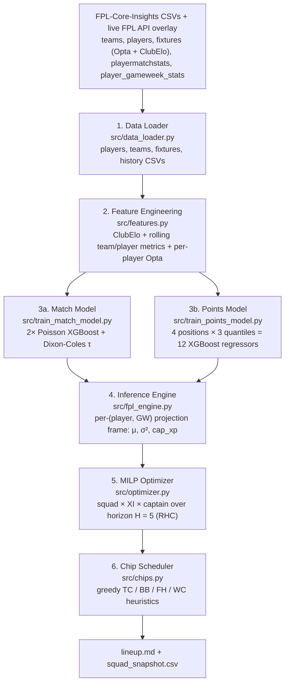

# Autonomous Fantasy Premier League ML Manager

[](https://www.python.org/)
[](https://xgboost.readthedocs.io/)
[](https://coin-or.github.io/pulp/)
[](../.github/workflows/weekly_update.yml)

A data-driven agent that picks and manages a 15-player Fantasy Premier League squad end-to-end. Each week the pipeline learns per-position, per-player point distributions with quantile-regression gradient boosting, estimates match-level goal rates with a Dixon–Coles-corrected Poisson model, and solves a single joint MILP for the 15-man squad, the starting XI, and the captain across a rolling horizon — then schedules chips on top. Data comes from the [olbauday/FPL-Core-Insights](https://github.com/olbauday/FPL-Core-Insights) CSV dataset (FPL API + Opta-like per-match stats + ClubElo ratings, refreshed twice daily) with a thin live-FPL-API overlay for current-GW prices and injury status.

> **New to FPL?** Start with the [FPL 101 primer](FPL_101.md). The math below assumes you understand clean sheets, appearance points, the bench-order auto-sub rule, and the transfer/chip system.

> **Scope disclaimer:** Research project for personal use. Past performance of the underlying models does not guarantee future FPL rank — the league is noisy and partly luck-driven by design.

---

## Table of Contents

1. [System Architecture](#1-system-architecture)
2. [Feature Engineering](#2-feature-engineering)
3. [Match Model](#3-match-model)
4. [Player Points Model](#4-player-points-model)
5. [Combinatorial Optimization](#5-combinatorial-optimization)
6. [Chip Scheduling](#6-chip-scheduling)
7. [Repository Layout](#7-repository-layout)
8. [Installation and Usage](#8-installation-and-usage)
9. [Future Work](#9-future-work)
10. [References](#10-references)
11. [Data and Credit](#data-and-credit)
12. [License](#license)

---

## 1. System Architecture

End-to-end pipeline from FPL-Core-Insights CSVs (with a live-FPL-API price overlay) to a weekly markdown report containing the squad, XI, captain, transfers, hits, and chip recommendations.



All model artifacts (Poisson boosters, quantile boosters) and intermediate CSVs are persisted under `data/`, so subsequent runs only retrain when an artifact is missing. The GitHub Actions workflow at [.github/workflows/weekly_update.yml](../.github/workflows/weekly_update.yml) re-runs the pipeline every Wednesday at 10:00 UTC.

---

## 2. Feature Engineering

Lives in [src/features.py](../src/features.py). Two feature families: team-level state for the match model, and player-level lags for the points model. Both are computed with strict GW-shifting to prevent leakage.

### 2.1 Team Elo

Pre-match Elo for both sides comes precomputed on every fixture from the FPL-Core-Insights dataset (ClubElo, point-in-time per match, see [clubelo.com](https://clubelo.com)) and is stamped onto every fixture as `elo_h_pre` / `elo_a_pre`. The chronological replay below is retained as a fallback for any rows where the dataset is missing or null:

$$E_h = \frac{1}{1 + 10^{-(R_h + \text{HFA} - R_a)/400}}$$

$$
S_h = \begin{cases}
1   & \text{if } g_h > g_a \\
0.5 & \text{if } g_h = g_a \\
0   & \text{if } g_h < g_a
\end{cases}
$$

$$R_h' = R_h + K \cdot \text{MoV} \cdot (S_h - E_h), \qquad \text{MoV} = (\lvert g_h - g_a \rvert + 1)^{0.4}$$

The MoV-multiplier idea is inspired by FiveThirtyEight's sports-Elo methodology — see [How We Calculate NBA Elo Ratings][ref-538] for the canonical writeup; our specific exponent of $0.4$ differs from 538's NBA formula but is in the same family and dampens the effect of blowouts while still rewarding decisive wins. Adapting Elo from chess to football match prediction is well-studied — see [Using ELO ratings for match result prediction in association football][ref-hvattum] for a validation against bookmaker odds. Hyperparameters below follow community sports-Elo conventions.

| Hyperparameter (fallback only) | Value |
|---|---|
| K-factor | 20 |
| Home-field advantage (HFA) | 60 Elo |
| Initial rating | 1500 |

### 2.2 Rolling team and player metrics

For the **match** model, two stat families are rolled forward at $w \in \{3, 5, 10\}$ for the FPL-derived block and at $w = 5$ for the Opta block, always **shifted by one GW** so features for fixture at GW $t$ only use information available before GW $t$:

$$\overline{\text{xG}}_{T,t}^{(w)} = \frac{1}{w} \sum_{k=t-w}^{t-1} \text{xG}_{T,k}$$

| Source | Stats |
|---|---|
| Aggregated FPL `history` (per-team, per-GW sums) | xG, xGA, GF, GA |
| Opta team-level on `fixtures.csv` (one row per side per match) | true Opta xG (`oxg`), big chances (`obc`), total shots (`osh`), and each conceded counterpart |

For the **points** model, each player row uses lagged minutes $m_{i,t-1}$, $m_{i,t-2}$, $m_{i,t-3}$ and 5- and 10-GW rolling per-player means of underlying metrics (xG, xA, xGI, BPS, ICT, saves, CBI, tackles, recoveries) plus six per-player Opta stats from `playermatchstats.csv` aggregated to per-(player, GW) sums first (Opta xG `oxg`, Opta xA `oxa`, chances created `occ`, touches in opposition box `otob`, total shots `osh`, successful dribbles `odrib`). Fixture-side context is pulled from the match-feature join: `is_home`, `opp_xg_5`, `opp_xga_5`, `opp_elo`, `own_elo`, `elo_gap`. Set-piece and penalty-taker flags come from the FPL playerstats. Rolling `total_points` is intentionally excluded — rolling it creates a feedback loop where premiums with one bad recent GW project lower indefinitely; underlying xG/xA/ICT carry the form signal without that pathology.

---

## 3. Match Model

Lives in [src/train_match_model.py](../src/train_match_model.py).

### 3.1 Poisson goal rates

Two independent XGBoost regressors with a `count:poisson` objective model expected goals for each side, following [XGBoost: A Scalable Tree Boosting System][ref-xgboost]:

$$\lambda_h = f_h(\mathbf{x}), \qquad \lambda_a = f_a(\mathbf{x})$$

where $\mathbf{x}$ is the 31-dimensional match feature vector from §2. A Bayesian hierarchical Poisson model — see e.g. [Bayesian hierarchical model for the prediction of football results][ref-baio] — was rejected because the FPL API only exposes a single season of data; with around 380 finished fixtures, partial-pooling posteriors cannot out-perform a tree ensemble that captures non-linear interactions (press intensity × block depth, Elo gap × home advantage, etc.).

### 3.2 Dixon–Coles low-score correction

Independent Poisson marginals over-predict $(0,1)$ and $(1,0)$ and under-predict $(0,0)$ and $(1,1)$ in football. [Modelling Association Football Scores and Inefficiencies in the Football Betting Market][ref-dc] fixes this with a multiplicative correction $\tau$ applied to the joint PMF on the four low-scoring corners:

$$P(X = x, Y = y) = \tau_{\lambda_h, \lambda_a}(x, y) \cdot \frac{\lambda_h^x e^{-\lambda_h}}{x!} \cdot \frac{\lambda_a^y e^{-\lambda_a}}{y!}$$

$$
\tau(x, y) = \begin{cases}
1 - \lambda_h \lambda_a \rho & \text{if } (x, y) = (0, 0) \\
1 + \lambda_h \rho           & \text{if } (x, y) = (0, 1) \\
1 + \lambda_a \rho           & \text{if } (x, y) = (1, 0) \\
1 - \rho                     & \text{if } (x, y) = (1, 1) \\
1                            & \text{otherwise}
\end{cases}
$$

We fix $\rho = -0.10$ (negative, as in the original paper). The truncated joint PMF is normalized to sum to 1 over $\{0, \dots, 8\}^2$.

### 3.3 Clean-sheet probabilities (analytic)

Clean sheets are computed directly from the Dixon–Coles joint matrix $M$ rather than via Monte Carlo:

$$P(\text{home CS}) = \sum_{x=0}^{8} M_{x, 0}, \qquad P(\text{away CS}) = \sum_{y=0}^{8} M_{0, y}$$

Sanity check: holding $\lambda_h = 1.5$ fixed, increasing $\lambda_a$ from $0.5$ to $2.5$ drops $P(\text{home CS})$ from $0.61$ to $0.08$. The sign is correct and the response curve is monotone.

---

## 4. Player Points Model

Lives in [src/train_points_model.py](../src/train_points_model.py).

### 4.1 Why quantile regression

FPL points per player per GW are discrete, heavy-tailed, and bimodal (zero for did-not-plays plus a wide distribution when playing). A single point estimate of the mean throws away information the optimizer needs:

| Quantile | Use in optimizer |
|---|---|
| q10 (downside floor) | Risk budgeting, variance estimate |
| q50 (median EV) | Primary objective μ — robust to heavy right tail |
| q90 (ceiling) | Triple Captain timing, variance estimate |

We therefore train **per-position** XGBoost regressors — one model per (position $\times$ quantile) cell, $4 \times 3 = 12$ boosters total — using the `reg:quantileerror` objective with $\alpha \in \{0.10, 0.50, 0.90\}$, which directly minimizes the pinball loss from [Regression Quantiles][ref-koenker]:

$$
\mathcal{L}_\alpha(y, \hat{y}) = \begin{cases}
\alpha \cdot (y - \hat{y})       & \text{if } y \geq \hat{y} \\
(1 - \alpha) \cdot (\hat{y} - y) & \text{if } y < \hat{y}
\end{cases}
$$

Target: raw FPL `total_points` per player per GW. **This subsumes every scoring rule end-to-end.** The model learns goal points, assist points, clean-sheet bonuses, defensive-action bonus thresholds, BPS, and all negative deductions jointly from the data; there is no hand-coded scoring table.

The single shared model previously regressed premium FWDs toward the mid-tier population mean — scoring distributions differ structurally per position (GKs save, DEFs collect CS bonuses, MIDs score+assist, FWDs convert) so position one-hots alone aren't enough at this data scale. Per-position models break the population-mean trap, with the trade-off that each subset is small (~3k rows for FWDs) and the q90 booster is sensitive to outliers — addressed with strong regularization (`max_depth=3`, `min_child_weight=30`, `reg_alpha=0.5`, `reg_lambda=2.0`) and a sanity ceiling that clips final predictions at 25 (a credible single-GW boom: hat-trick + assist + bonus).

### 4.2 Post-hoc non-crossing

Independently fit quantile regressors can cross — the predicted 10th percentile may end up greater than the predicted 50th — which is nonsensical. We enforce monotonicity row-wise by sorting predictions ascending at inference:

$$[\hat{q}_{10},\; \hat{q}_{50},\; \hat{q}_{90}] \;\leftarrow\; \text{sort}\bigl([\hat{q}_{10},\; \hat{q}_{50},\; \hat{q}_{90}]\bigr)$$

Simple, and arguably less principled than constrained optimization à la [Quantile and Probability Curves Without Crossing][ref-chernozhukov], but empirically affects under 2% of rows in our data — not worth the implementation cost for now.

### 4.3 Inference: handling DGWs, BGWs, and injuries

For each player $i$ and upcoming GW $t$, we locate every fixture their club plays that GW (0, 1, or 2) and build one feature row per fixture. Quantile predictions are then:

1. **Scaled by forward-looking availability** $a_i = \text{chance of playing next round}_i / 100$, zeroed if the player's `status` is suspended, out, or unavailable. Historical availability is already captured implicitly through the lagged-minute features, so this only adds forward-looking injury information.
2. **Aggregated across fixtures per (i, t)** by simple summation:

$$\hat{q}^{(i,t)}_\alpha = \sum_{f \in F_{i,t}} a_i \cdot \hat{q}^{(i,f)}_\alpha, \qquad \alpha \in \{0.10, 0.50, 0.90\}$$

A blank GW yields $F_{i,t} = \emptyset$ and therefore $\hat{q}^{(i,t)}_\alpha = 0$; a double GW stacks both fixtures additively.

### 4.4 Variance estimate from quantile spread

The optimizer's risk term needs a scalar variance per $(i, t)$. Assuming the points distribution is approximately Gaussian in the central mass for players expected to play, the interval from q10 to q90 spans about 2.56 standard deviations (formally, $\Phi^{-1}(0.9) - \Phi^{-1}(0.1) \approx 2.56$):

$$\hat{\sigma}^2_{i,t} \approx \left( \frac{\hat{q}^{(i,t)}_{90} - \hat{q}^{(i,t)}_{10}}{2.56} \right)^2$$

This is lighter than a full Monte-Carlo covariance estimate (which the linear CBC solver could not consume anyway) but preserves the core signal: players with wide quantile spreads are penalized more heavily in the squad objective.

### 4.5 Captaincy score

Captaincy is a separate decision from XI selection: the optimizer's captain term contributes $\kappa_{i,t} \cdot c_{i,t}$ independently of $\mu_{i,t} \cdot s_{i,t}$. Pure $\hat{q}_{90}$ as the captain reward over-weighted ceiling and crowned low-mean / high-variance players over high-mean MIDs with comparable upside. We anchor the captain reward on the median EV and add a fraction of the upside premium:

$$\kappa_{i,t} = \hat{q}^{(i,t)}_{50} + \gamma \cdot \bigl(\hat{q}^{(i,t)}_{90} - \hat{q}^{(i,t)}_{50}\bigr), \qquad \gamma = 0.3$$

Mean is the dominant signal; ceiling is a tiebreaker among similar-mean candidates. The `CAP_UPSIDE_WEIGHT` constant in [src/fpl_engine.py](../src/fpl_engine.py) is the tunable knob — lower it (e.g. 0.2) for safer captains, raise it (0.5+) for more boom-chasing.

---

## 5. Combinatorial Optimization

Lives in [src/optimizer.py](../src/optimizer.py). Solved with PuLP — see [PuLP: A Linear Programming Toolkit for Python][ref-pulp] — using the bundled COIN-OR CBC solver.

### 5.1 Decision variables

Per player $i \in \{1, \dots, N\}$ and GW $t \in \{t_0, \dots, t_0 + H - 1\}$, with horizon $H = 5$:

| Variable | Domain | Meaning |
|---|---|---|
| $x_{i,t}$ | binary | In 15-man squad at GW $t$ |
| $s_{i,t}$ | binary | In starting XI at GW $t$ |
| $c_{i,t}$ | binary | Captain at GW $t$ |
| $\text{tin}_{i,t}$ | binary | Newly transferred IN at GW $t$ |
| $\text{ft}_t$ | integer, 1 to 5 | Free transfers banked entering GW $t$ |
| $\text{sv}_t$ | integer, 0 to 5 | Free transfers saved out of GW $t$ |
| $h_t$ | non-negative integer | Number of 4-pt hits taken at GW $t$ |

For the cold-start solve, $x_{i,t}$ collapses to a single $x_i$ (no transfers yet, with the squad fixed across the horizon).

### 5.2 Objective

$$\max \sum_{t=t_0}^{t_0 + H - 1} \sum_{i=1}^{N} \Bigl[\, \mu_{i,t}\, s_{i,t} \;+\; b \cdot \mu_{i,t}\, (x_{i,t} - s_{i,t}) \;+\; \kappa_{i,t}\, c_{i,t} \;-\; \nu\, \hat{\sigma}^2_{i,t}\, x_{i,t} \;+\; \eta\, \mu_{i,t}\, (1 - \text{EO}_i)\, x_{i,t} \,\Bigr] \;-\; \sum_{t} 4\, h_t$$

| Term | Role |
|---|---|
| $\mu_{i,t}\, s_{i,t}$ | Starter expected points |
| $b \cdot \mu_{i,t}\, (x_{i,t} - s_{i,t})$ | Bench auto-sub EV ($b = 0.15$) |
| $\kappa_{i,t}\, c_{i,t}$ | Captain reward $\kappa_{i,t}$ from §4.5 |
| $-\nu\, \hat{\sigma}^2_{i,t}\, x_{i,t}$ | Risk penalty (diagonal Markowitz) |
| $\eta\, \mu_{i,t}\, (1 - \text{EO}_i)\, x_{i,t}$ | Differential / EO tilt (zero by default) |
| $-4\, h_t$ | Hit cost |

Design notes:

- $\mu_{i,t} = \hat{q}^{(i,t)}_{50}$ is the median EV, more robust to the heavy right tail than the mean.
- The bench weight $b = 0.15$ is an empirical estimate of auto-sub realization, roughly $P(\text{bench player auto-subbed in})$ multiplied by the average fraction of starter points retained.
- **EO tilt** $\eta \cdot \mu \cdot (1 - \text{EO})$ defaults to zero, which targets pure points EV. Setting $\eta > 0$ late in the season pushes the solver toward differentials (high EV, low ownership) to maximize rank-EV. The $\mu - \nu \sigma^2$ baseline structure is the same Markowitz-style mean–variance trade-off applied to fantasy lineup selection by [Picking Winners in Daily Fantasy Sports Using Integer Programming][ref-hvz].
- A full quadratic portfolio variance $x^\top \Sigma x$ would require MIQP; CBC is LP-only, so we take the diagonal approximation. Within-team correlation is bounded by the 3-per-club constraint and partly absorbed into learned $\hat{\sigma}^2_{i,t}$ values.

### 5.3 Structural constraints (applied at every $t$)

Squad size and positional quotas: 2 GK, 5 DEF, 5 MID, 3 FWD, totaling 15:

$$\sum_i x_{i,t} = 15, \qquad \sum_{i\,:\,\text{pos}(i) = p} x_{i,t} = q_p$$

with $q_1 = 2$, $q_2 = 5$, $q_3 = 5$, $q_4 = 3$. Club cap of 3 players per Premier League club, and a budget cap:

$$\sum_{i\,:\,\text{club}(i) = k} x_{i,t} \leq 3 \quad \forall k, \qquad \sum_i p_i\, x_{i,t} \leq B_t$$

where $B_t$ equals the previous squad value plus uninvested bank. Starting XI and captain:

$$\sum_i s_{i,t} = 11, \qquad \sum_i c_{i,t} = 1, \qquad c_{i,t} \leq s_{i,t} \leq x_{i,t}, \qquad c_{i,t} = 0 \;\; \forall\, i \text{ s.t. } \text{pos}(i) \in \{1, 2\}$$

The trailing term enforces a **MID/FWD-only captaincy rule** — defender booms (CS + goal) are correlated with team performance, so doubling them leaks rank-EV; uncorrelated upside lives in the attack. Formation minima — exactly 1 GK starts, at least 3 DEF, at least 2 MID, at least 1 FWD:

$$\sum_{i\,:\,\text{pos}(i) = 1} s_{i,t} = 1, \qquad \sum_{i\,:\,\text{pos}(i) = p} s_{i,t} \geq r_p$$

with $r_1 = 1$, $r_2 = 3$, $r_3 = 2$, $r_4 = 1$. The $c_{i,t} \leq s_{i,t}$ link guarantees the captain cannot be on the bench.

### 5.4 Transfer accounting

Transfer indicator for player $i$ at GW $t$:

$$\text{tin}_{i,t} \geq x_{i,t} - x_{i,t-1}$$

with $x_{i, t_0 - 1} = 1$ if player $i$ was in the prior squad, else $0$. Free-transfer conservation, with a cap of 5:

$$\text{ft}_{t_0} = \text{ft}^{\text{init}}, \qquad \text{ft}_t = \min\!\bigl(5,\; 1 + \text{sv}_{t-1}\bigr) \text{ for } t > t_0$$

Transfer budget at each GW — total transfers in equals free transfers used plus hits, and saved transfers cannot exceed those held:

$$\sum_i \text{tin}_{i,t} = (\text{ft}_t - \text{sv}_t) + h_t, \qquad h_t \geq 0, \qquad \text{sv}_t \leq \text{ft}_t$$

Combined with the $-4 h_t$ term in the objective, the solver only commits a hit when the expected gain strictly exceeds 4 points.

### 5.5 Receding Horizon Control

The full multi-period MILP is solved with $H = 5$ look-ahead each week, but only the decisions for $t_0$ (the next GW) are executed: `transfers_in`, `transfers_out`, `xi_ids`, `captain`, `vice`, `hits`. The following week's run re-solves from the updated state (squad, bank, free transfers). This is the standard MPC formulation; see [Model Predictive Control: Recent Developments and Future Promise][ref-mpc] for a modern survey of stochastic and economic MPC, which informs how RHC trades long-horizon optimality against the wrongness of far-future EV predictions.

---

## 6. Chip Scheduling

Lives in [src/chips.py](../src/chips.py). Chip activation is a convex function of fixture quality that the weekly MILP does not see directly, so it is handled as a greedy post-processing heuristic over the same projection frame.

| Chip | Heuristic |
|---|---|
| **Triple Captain** | Pick the GW and owned MID/FWD maximizing the captaincy score $\kappa_{i,t}$ from §4.5: $t^{\star},\, i^{\star} = \arg\max_{t,\, i \in \text{squad},\, \text{pos}(i) \in \{3, 4\}}\, \kappa_{i,t}$ |
| **Bench Boost** | Pick the GW with the highest total bench EV: $t^{\star} = \arg\max_{t}\, \sum_{i \in \text{bench}} \hat{q}^{(i,t)}_{50}$ |
| **Free Hit** | Pick the GW with the most teams blanking: $t^{\star} = \arg\max_{t}\, \lvert \{ k : k \text{ blanks at } t \} \rvert$ |
| **Wildcard** | Trigger if the RHC proposes ≥ 4 transfers IN or ≥ 2 hits — the MILP's willingness to pay hits is a proxy signal that the current squad is far from optimal. |

---

## 7. Repository Layout

```
fpl-ml-manager/
├── src/
│   ├── main.py                  # Orchestrator + markdown report writer
│   ├── data_loader.py           # FPL-Core-Insights CSV loader + live FPL API price overlay
│   ├── features.py              # ClubElo + rolling team/player + per-player Opta features
│   ├── train_match_model.py     # Poisson goals + DC τ + analytic CS
│   ├── train_points_model.py    # Per-position Quantile XGBoost (12 boosters)
│   ├── fpl_engine.py            # Inference engine, projection frame builder
│   ├── optimizer.py             # MILP squad + XI + captain, RHC transfers
│   └── chips.py                 # TC / BB / FH / WC heuristics
├── data/
│   ├── players.csv, teams.csv, fixtures.csv, history.csv
│   ├── .fpl_ci_cache/                    # raw FPL-CI per-GW snapshots (cache only)
│   ├── xgb_home_goals.json, xgb_away_goals.json
│   ├── xgb_points_q{10,50,90}_p{1,2,3,4}.json   # 4 positions × 3 quantiles
│   └── processed/
│       ├── lineup.md            # Weekly markdown report (generated)
│       └── squad_snapshot.csv   # Carried state for next RHC pass
├── docs/
│   ├── README.md                # This file
│   └── FPL_101.md               # Domain primer
└── .github/workflows/
    └── weekly_update.yml        # GitHub Actions: Wednesdays 10:00 UTC
```

---

## 8. Installation and Usage

### Requirements

- Python 3.11+
- No GPU required — XGBoost CPU is fast enough for this dataset size

### Local setup

```bash
# 1. Clone
git clone https://github.com/truong-tt/fpl-ml-manager
cd fpl-ml-manager

# 2. Create and activate a virtual environment
python3.11 -m venv .venv
source .venv/bin/activate          # Windows: .venv\Scripts\activate

# 3. Install dependencies
pip install -r requirements.txt

# 4. Run the full pipeline
python src/main.py
```

First run trains every model artifact from scratch; subsequent runs reuse `data/*.json` and only retrain when a file is missing. Output is written to [data/processed/lineup.md](../data/processed/lineup.md). The carried squad state lives at [data/processed/squad_snapshot.csv](../data/processed/squad_snapshot.csv) and is consumed by the next week's RHC pass.

### Scheduled runs

The GitHub Actions workflow at [.github/workflows/weekly_update.yml](../.github/workflows/weekly_update.yml) runs every Wednesday at 10:00 UTC and commits the refreshed report back to the repo.

---

## 9. Future Work

- **Correlated-risk portfolio objective.** Replace the diagonal $\hat{\sigma}^2$ penalty with a proper $x^\top \Sigma x$ term driven by joint match-player Monte Carlo. Requires migrating from CBC to a MIQP solver (Gurobi / CPLEX / SCIP).
- **Set-piece and manager regime changes.** Embedding-based detection of regime breaks (new manager, new set-piece taker) that invalidate historical rolling features.
- **Learned chip scheduler.** Re-formulate chip activation as a jointly-solved MILP extension rather than a post-hoc heuristic.

---

## 10. References

**Boosting and quantile regression**

- [XGBoost: A Scalable Tree Boosting System][ref-xgboost] — Chen & Guestrin, *KDD* 2016. Backbone for both the Poisson goal model and the three quantile point models.
- [Regression Quantiles][ref-koenker] — Koenker & Bassett, *Econometrica* 1978. Origin of the pinball / check loss that XGBoost's `reg:quantileerror` objective minimizes for the q10 / q50 / q90 boosters.
- [Quantile and Probability Curves Without Crossing][ref-chernozhukov] — Chernozhukov, Fernández-Val & Galichon, *Econometrica* 2010. Principled non-crossing alternative to the row-sort heuristic used here.

**Football scoring models**

- [Modelling Association Football Scores and Inefficiencies in the Football Betting Market][ref-dc] — Dixon & Coles, *Journal of the Royal Statistical Society* 1997. Source of the low-score $\tau$ correction applied to the joint Poisson PMF.
- [Bayesian hierarchical model for the prediction of football results][ref-baio] — Baio & Blangiardo, *Journal of Applied Statistics* 2010. Modern Bayesian hierarchical Poisson goal-scoring model — alternative considered and rejected for single-season sample-size reasons.

**Ratings**

- [Using ELO ratings for match result prediction in association football][ref-hvattum] — Hvattum & Arntzen, *International Journal of Forecasting* 2010. Adapts Elo from chess to football and validates against bookmaker odds.
- [How We Calculate NBA Elo Ratings][ref-538] — Silver & Fischer-Baum, FiveThirtyEight 2015. Source of the margin-of-victory multiplier idea.

**Optimization**

- [Picking Winners in Daily Fantasy Sports Using Integer Programming][ref-hvz] — Hunter, Vielma & Zaman, 2016. Direct precedent for applying portfolio-style integer programming to fantasy sports lineup selection; motivates the $\mu - \nu \sigma^2$ structure of the squad objective in the FPL setting.
- [Model Predictive Control: Recent Developments and Future Promise][ref-mpc] — Mayne, *Automatica* 2014. Modern survey of MPC including stochastic/economic variants; canonical reference for the Receding Horizon Control structure used here.
- [PuLP: A Linear Programming Toolkit for Python][ref-pulp] — Mitchell, O'Sullivan & Dunning, 2011. Modeling layer over the COIN-OR CBC solver used here.

**Data sources**

- [olbauday/FPL-Core-Insights][ref-fpl-ci] — primary dataset. CSVs combining the FPL API + Opta-like per-match stats + ClubElo ratings, refreshed twice daily. Used files: `teams.csv`, `players.csv`, `By Gameweek/GW{n}/{fixtures, playerstats, player_gameweek_stats, playermatchstats}.csv`, `gameweek_summaries.csv`.
- [Fantasy Premier League Public API][ref-fpl] — live overlay. Used only for the `bootstrap-static/` endpoint to refresh current-GW prices, ownership, status, and `chance_of_playing_next_round` (FPL-CI lags by up to 12h).
- [ClubElo][ref-clubelo] — Elo ratings exposed on FPL-CI's fixtures.csv (`home_team_elo`, `away_team_elo`).

[ref-xgboost]: https://arxiv.org/abs/1603.02754
[ref-dc]: https://www.ajbuckeconbikesail.net/wkpapers/Airports/MVPoisson/soccer_betting.pdf
[ref-baio]: https://doi.org/10.1080/02664760802684177
[ref-koenker]: https://people.eecs.berkeley.edu/~jordan/sail/readings/koenker-bassett.pdf
[ref-chernozhukov]: http://alfredgalichon.com/wp-content/uploads/2012/10/Econometrica_article_may-2010.pdf
[ref-538]: https://fivethirtyeight.com/features/how-we-calculate-nba-elo-ratings/
[ref-hvz]: https://arxiv.org/abs/1604.01455
[ref-mpc]: https://doi.org/10.1016/j.automatica.2014.10.128
[ref-hvattum]: https://www.sciencedirect.com/science/article/abs/pii/S0169207009001708
[ref-pulp]: https://github.com/coin-or/Cbc
[ref-fpl]: https://fantasy.premierleague.com/api/
[ref-fpl-ci]: https://github.com/olbauday/FPL-Core-Insights
[ref-clubelo]: https://clubelo.com

---

## Data and Credit

All credit for upstream data goes to the providers listed in §10. Use of these sources is subject to each provider's own terms; this project consumes only public, read-only endpoints / files and is not affiliated with or endorsed by the Premier League, ClubElo, or the FPL-Core-Insights maintainers.

---

## License

TBD.

> **Note:** The FPL API, FPL-Core-Insights dataset, and ClubElo data are governed by their own separate terms.
